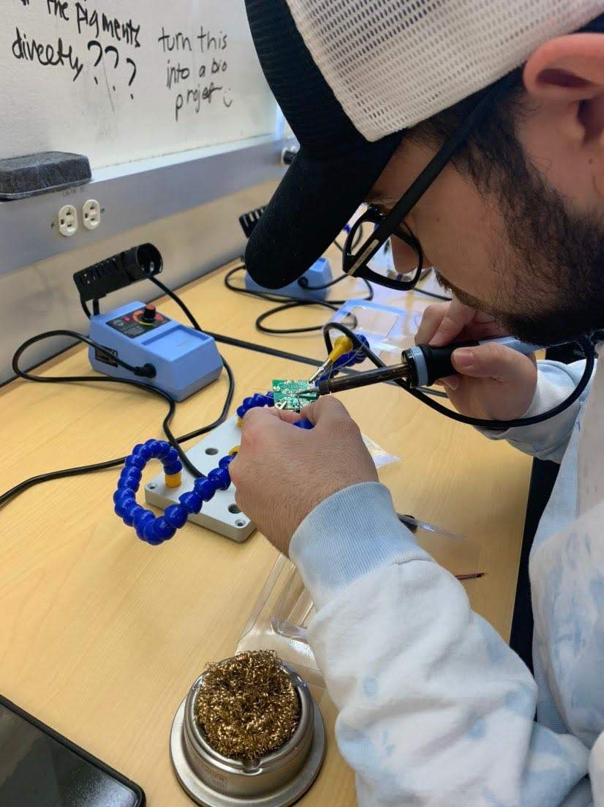
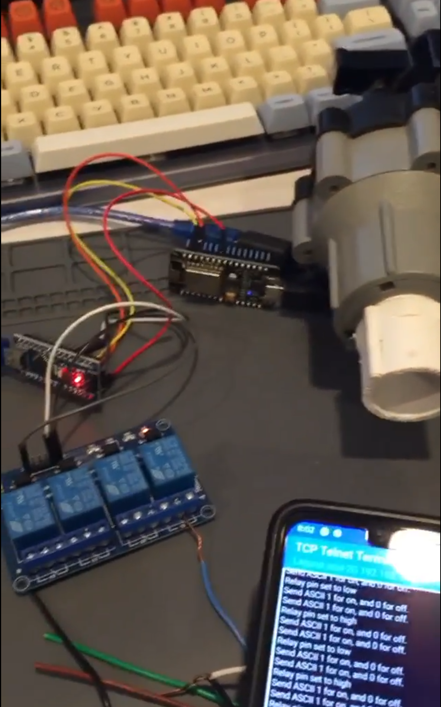
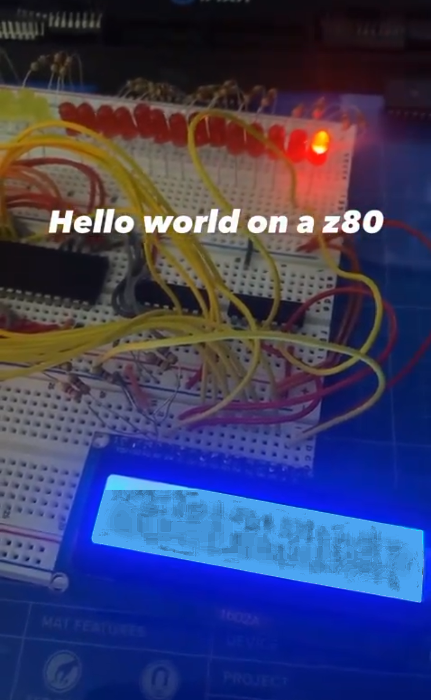
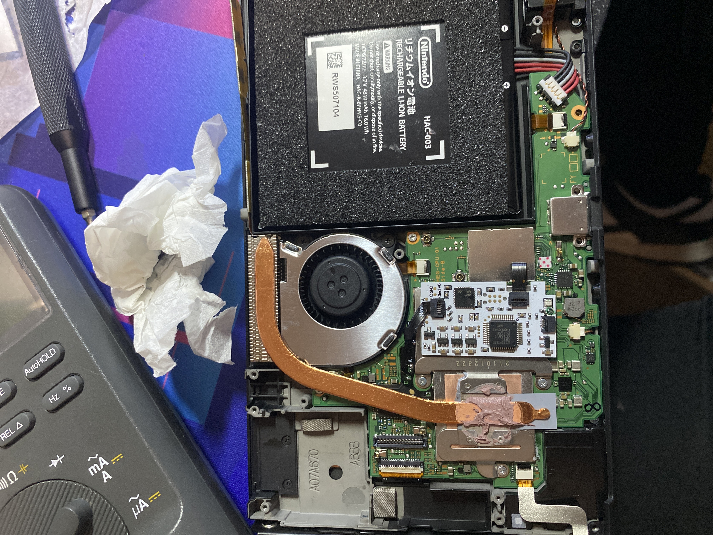
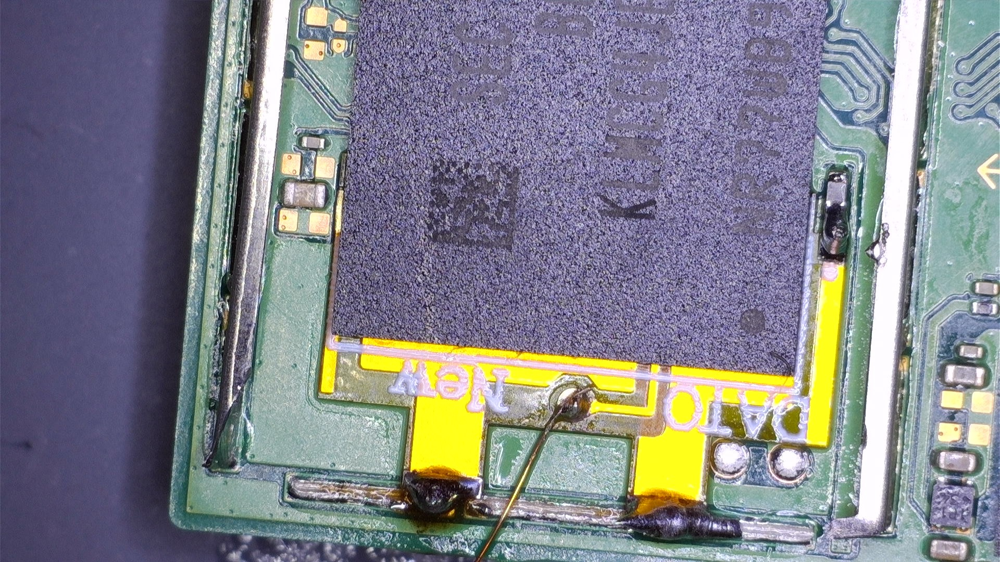
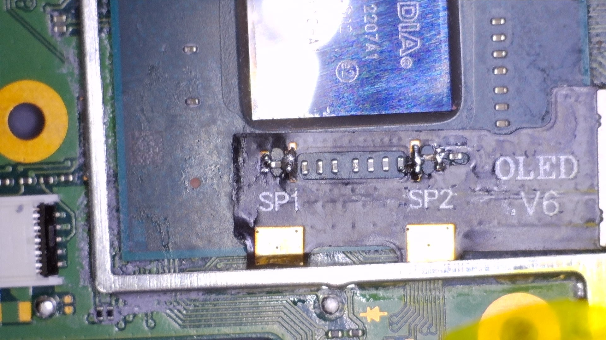
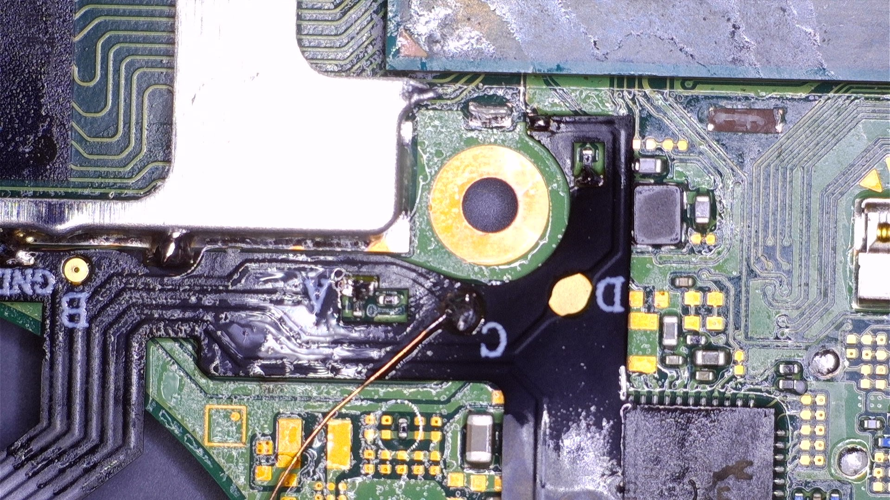

# Early Hardware Projects

A collection of my first hardware projects, ranging from a freshman-year soldering lab to microsoldering a Nintendo Switch. These are the projects that got me into embedded systems and hardware hacking.

---

## 1. First Time Soldering (2019)

My very first time ever holding a soldering iron — a one-day intro activity during my freshman year.



No prior experience, just learning how to tin a tip, hold the iron, and get solder to flow onto a PCB pad. It was enough to get hooked.

---

## 2. WiFi-Controlled Sprinkler (Arduino + NodeMCU)

A two-board system where a NodeMCU (ESP8266) acts as a WiFi gateway and an Arduino controls a 4-channel relay that drives the sprinkler valve.



**What's in the photo:** the 4-channel relay board (blue), the NodeMCU on the breadboard, the Arduino (red LED visible), and a phone running a TCP terminal app showing the on/off commands being sent.

**Code files for this project:**

- `Arduino/nodemcu/nodemcu.ino` — WiFi gateway: connects to WiFi, opens a TCP server on port 8181, receives ASCII `1`/`0`, forwards the command over I2C to the Arduino
- `Arduino/arduino/arduino.ino` — I2C slave: listens on address 8, receives the byte from the NodeMCU, and fires the relay
- `Arduino/sketch_may21a/` and `Arduino/arduino/sketch_may25a/` — Early standalone test sketches (not part of the final system): just toggled the relay on and off every 10s to confirm the relay module was wired correctly before the I2C/WiFi layer was added

### How it works

The NodeMCU connects to WiFi and opens a raw TCP server on port 8181. You send ASCII `1` to turn the sprinkler on, or `0` to turn it off. The NodeMCU then forwards the command to the Arduino over I2C, and the Arduino triggers the relay.

```
Phone/PC → TCP (port 8181) → NodeMCU (ESP8266) → I2C → Arduino Uno → Relay → Sprinkler valve
```

> **Note:** Replace `YOUR_WIFI_SSID` and `YOUR_WIFI_PASSWORD` in `nodemcu.ino` with your own credentials before flashing.

---

## 3. Z80 "Hello World" on a Breadboard

An attempt at building a working Z80-based computer on a breadboard and getting it to display "Hello World" on a 16×2 character LCD.



This was the last saved state of the project. The LCD backlight was extremely bright in the original photo — the image above has been processed to make the "Hello World" text on the display visible. The red LEDs on the breadboard are address/data bus indicators.

Getting the Z80 to initialize, clock, and write to an LCD from scratch on a breadboard involves a lot of wire and a lot of patience. The project didn't go much further than this, but "Hello World" on a bare Z80 is a milestone worth saving.

---

## 4. Nintendo Switch Modchip (RCMLoader / SX Core)

My first real microsoldering job — installing a modchip on a Nintendo Switch. Successful in the end.

| Shot | What it shows |
|------|--------------|
|  | Switch opened, battery and heatsink/fan visible |
|  | DAT0 eMMC pad area — one of the key solder points for the modchip |
|  | Near the Tegra X1 CPU (labeled OLED V6 board), SP1/SP2 pads |
|  | Another fine-pitch solder connection point on the board |

Microsoldering at this scale (sub-millimeter pads, using flux and fine gauge wire) is a completely different skill from normal through-hole or even SMD soldering. This was the project that made it click.
